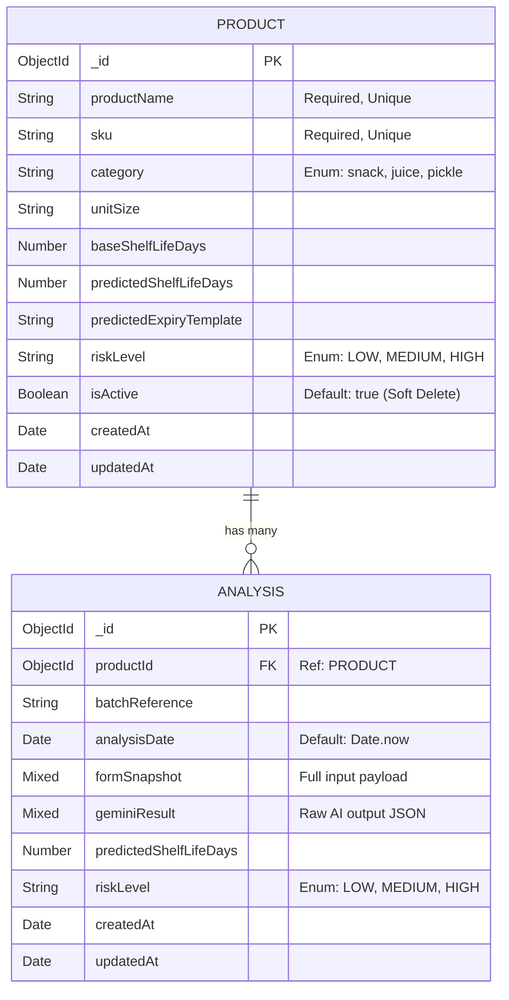

# AI-Based Food Shelf Life Prediction System

HimShakti Food Processing is introducing an AI-powered system to analyze ingredients, sourcing context, and processing methods to predict the realistic shelf life of products. This backend system integrates with a React frontend and utilizes the Gemini 2.5 Flash model to provide accurate shelf life predictions and actionable risk mitigation strategies.

---

## 🏗️ Architecture & Database Schema

The backend uses **Node.js, Express, and MongoDB Atlas (Mongoose ODM)**.

### Entity Relationship Diagram (ERD)



---

## 🚀 Setup Instructions

1. **Clone the repository** and navigate to the backend folder:
   ```bash
   cd backend
   ```

2. **Install Dependencies**:
   ```bash
   npm install
   ```

3. **Environment Variables**:
   Create a `.env` file in the `backend` root and configure the following:
   ```env
   MONGODB_URI=your_mongodb_atlas_connection_string
   GEMINI_API_KEY=your_gemini_api_key
   PORT=5050
   NODE_ENV=development
   FRONTEND_URL=http://localhost:5173
   ```

4. **Seed the Database** (Optional):
   Populate the MongoDB database with initial sample products.
   ```bash
   npm run seed
   ```

5. **Start the Development Server**:
   ```bash
   npm run dev
   ```

---

## 📡 API Endpoints

### 📦 Products (`/api/products`)

| Method | Endpoint | Description |
|--------|----------|-------------|
| `GET` | `/api/products` | Retrieve all active products (`isActive: true`) |
| `GET` | `/api/products/:id` | Retrieve a specific product by ID |
| `POST` | `/api/products` | Create a new product |
| `PUT` | `/api/products/:id` | Full update of a product |
| `PATCH` | `/api/products/:id` | Partial update of a product |
| `DELETE` | `/api/products/:id` | Soft-delete a product (sets `isActive: false`) |

### 🤖 Shelf Life & AI Analysis (`/api/shelf-life`)

| Method | Endpoint | Description |
|--------|----------|-------------|
| `POST` | `/api/shelf-life/analyse` | Run Gemini analysis on form data and store in `Analysis` collection |
| `GET` | `/api/shelf-life/history` | Get paginated prediction history (`?page=1&limit=10`) |
| `GET` | `/api/shelf-life/prefetch/:productId` | Get the most recent cached analysis for a product |
| `POST` | `/api/shelf-life/prefetch-all` | Trigger background predictions for all active products |

### 📊 System Stats (`/api/stats`)

| Method | Endpoint | Description |
|--------|----------|-------------|
| `GET` | `/api/stats` | Get live DB metrics: analyses run, active products, safe batches, etc. |
| `GET` | `/health` | Server health check and DB connection status |

---

## 🛠️ Tech Stack
- **Node.js & Express.js**: REST API framework
- **MongoDB Atlas & Mongoose**: Database & ODM
- **Google Generative AI**: Gemini 2.5 Flash for shelf life predictions
- **Helmet & CORS**: Security middleware
- **Express Rate Limit**: Request throttling
