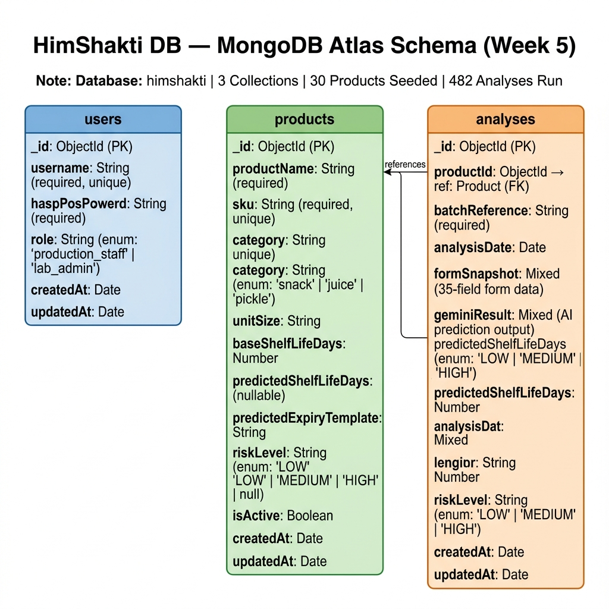
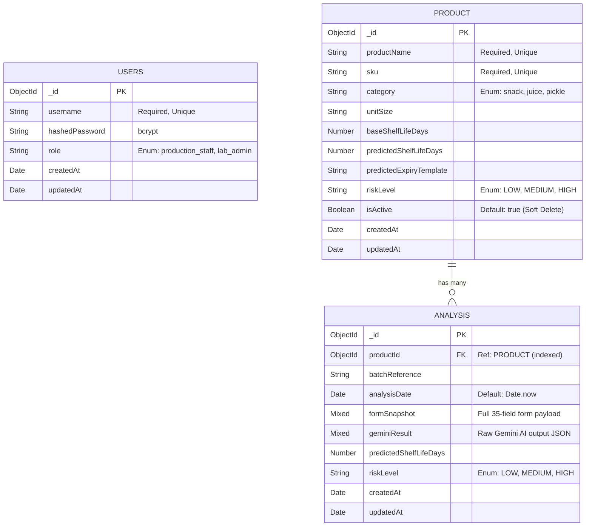

# AI-Based Food Shelf Life Prediction System

HimShakti Food Processing is introducing an AI-powered system to analyze ingredients, sourcing context, and processing methods to predict the realistic shelf life of products. This backend system integrates with a React frontend and utilizes the Gemini 2.5 Flash model to provide accurate shelf life predictions and actionable risk mitigation strategies.

> **Week 5 Update:** Fully migrated from in-memory data to **MongoDB Atlas**. All 6+ API endpoints now read from and write to the real database. 30 products seeded, 482+ analyses stored.

---

## 🌐 Deployment (Week 9 Deliverables)

### App URLs
- **Live Frontend URL:** https://ai-based-food-shelf-life-prediction.vercel.app
- **Live Backend URL:** https://ai-based-food-shelf-life-prediction.vercel.app
*(Note: Both frontend and backend are now unified on a single Vercel deployment for faster performance)*

### Tech Stack Summary
- **Frontend:** React 19 + Vite + Tailwind CSS (Hosted on Vercel)
- **Backend:** Node.js + Express 5 (Serverless Functions on Vercel)
- **Database:** MongoDB Atlas (M0 free tier)
- **AI Integration:** Google Gemini 2.5 Flash API
- **Authentication:** JWT (HTTP-only cookie) + Google OAuth

### Known Limitations on Free Tier
- **Vercel Serverless Cold Starts:** If the backend isn't used for a while, the Vercel serverless function spins down. The very first request after being idle might take 3-5 seconds to spin up and connect to the database. (Significantly faster than Render's 50-second wake up time).
- **MongoDB Atlas M0:** Limited to 512 MB storage and shared compute, which is perfectly sufficient for this application's current scale.
- **Vercel Hobby Tier:** Bandwidth is limited to 100 GB/month, which is more than enough for demo and internship grading purposes.

---


## 🏗️ Architecture & Database Schema

The backend uses **Node.js, Express, and MongoDB Atlas (Mongoose ODM)**.

### Why MongoDB Atlas?

| Reason | Detail |
|--------|--------|
| **Flexible Schema** | `formSnapshot` and `geminiResult` are deeply nested JSON objects — MongoDB's `Mixed` type stores these natively without migrations |
| **Rapid Iteration** | New form fields were added iteratively during development without ALTER TABLE |
| **AI Output** | Gemini returns complex nested JSON; document model avoids normalisation overhead |
| **Free Tier** | Atlas M0 (512MB free) is sufficient for HimShakti's scale |
| **Mongoose ODM** | Clean validation, middleware hooks, and `timestamps: true` out of the box |

### Collections & Models

| Collection | Model File | Records |
|------------|-----------|--------|
| `users` | `backend/src/models/User.model.js` | 2 seeded (staff, admin) |
| `products` | `backend/src/models/Product.model.js` | 30 seeded |
| `analyses` | `backend/src/models/Analysis.model.js` | 482+ stored |

### Schema Diagram (Week 5)



### Entity Relationship Diagram (ERD)


```mermaid
erDiagram
    USERS {
        ObjectId _id PK
        String username "Required, Unique"
        String hashedPassword "bcrypt"
        String role "Enum: production_staff, lab_admin"
        Date createdAt
        Date updatedAt
    }

    PRODUCT {
        ObjectId _id PK
        String productName "Required, Unique"
        String sku "Required, Unique"
        String category "Enum: snack, juice, pickle"
        String unitSize
        Number baseShelfLifeDays
        Number predictedShelfLifeDays
        String predictedExpiryTemplate
        String riskLevel "Enum: LOW, MEDIUM, HIGH"
        Boolean isActive "Default: true (Soft Delete)"
        Date createdAt
        Date updatedAt
    }

    ANALYSIS {
        ObjectId _id PK
        ObjectId productId FK "Ref: PRODUCT (indexed)"
        String batchReference
        Date analysisDate "Default: Date.now"
        Mixed formSnapshot "Full 35-field form payload"
        Mixed geminiResult "Raw Gemini AI output JSON"
        Number predictedShelfLifeDays
        String riskLevel "Enum: LOW, MEDIUM, HIGH"
        Date createdAt
        Date updatedAt
    }

    PRODUCT ||--o{ ANALYSIS : "has many"
```

---

## 🚀 Setup Instructions

1. **Clone the repository** and navigate to the backend folder:
   ```bash
   cd backend
   ```

2. **Install Dependencies**:
   ```bash
   npm install
   ```

3. **Environment Variables**:
   Copy `backend/.env.example` to `backend/.env` and fill in your values:
   ```env
   MONGO_URI=mongodb+srv://<username>:<password>@<cluster>.mongodb.net/himshakti
   GEMINI_API_KEY=your_google_gemini_api_key_here
   JWT_SECRET=your_jwt_secret_key_here
   PORT=5050
   NODE_ENV=development
   ```

   **Getting your MongoDB Atlas URI:**
   1. Go to [cloud.mongodb.com](https://cloud.mongodb.com) → Create free M0 cluster
   2. Database → Connect → Drivers → Node.js → Copy connection string
   3. Replace `<username>`, `<password>`, and set database name to `himshakti`

4. **Seed the Database** (Optional):
   Populate the MongoDB database with initial sample products.
   ```bash
   npm run seed
   ```

5. **Start the Development Server**:
   ```bash
   npm run dev
   ```

---

## 📡 API Endpoints

### 📦 Products (`/api/products`)

| Method | Endpoint | Description |
|--------|----------|-------------|
| `GET` | `/api/products` | Retrieve all active products (`isActive: true`) |
| `GET` | `/api/products/:id` | Retrieve a specific product by ID |
| `POST` | `/api/products` | Create a new product |
| `PUT` | `/api/products/:id` | Full update of a product |
| `PATCH` | `/api/products/:id` | Partial update of a product |
| `DELETE` | `/api/products/:id` | Soft-delete a product (sets `isActive: false`) |

### 🤖 Shelf Life & AI Analysis (`/api/shelf-life`)

| Method | Endpoint | Description |
|--------|----------|-------------|
| `POST` | `/api/shelf-life/analyse` | Run Gemini analysis on form data and store in `Analysis` collection |
| `GET` | `/api/shelf-life/history` | Get paginated prediction history (`?page=1&limit=10`) |
| `GET` | `/api/shelf-life/prefetch/:productId` | Get the most recent cached analysis for a product |
| `POST` | `/api/shelf-life/prefetch-all` | Trigger background predictions for all active products |

### 📊 System Stats (`/api/stats`)

| Method | Endpoint | Description |
|--------|----------|-------------|
| `GET` | `/api/stats` | Get live DB metrics: analyses run, active products, safe batches, etc. |
| `GET` | `/health` | Server health check and DB connection status |

---

## 🛠️ Tech Stack
- **Node.js & Express.js**: REST API framework
- **MongoDB Atlas & Mongoose**: Database & ODM
- **Google Generative AI**: Gemini 2.5 Flash for shelf life predictions
- **Helmet & CORS**: Security middleware
- **Express Rate Limit**: Request throttling
